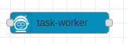
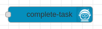
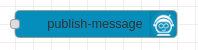
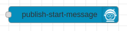
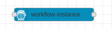

# node-red-contrib-zeebe
Zeebe nodes for Node-RED

This module integrates the Zeebe Node.js Client https://creditsenseau.github.io/zeebe-client-node-js/index.html.
It provides the following Zeebe nodes for Node-RED:

### task-worker

Creates a task worker and subscribes to specific tasks/jobs. This node outputs a Node-RED message for each newly received task/job.

### complete-task

When a Node-RED message is received at the input, this node completes a specific Zeebe task/job (with either success or failure).

### publish-message

When a Node-RED message is received at the input, this node publishes a message to Zeebe.

### publish-start-message

When a Node-RED message is received at the input, this node publishes a start message to Zeebe. No correlation key needed.

### workflow-instance

When a Node-RED message is received at the input, a new workflow instance gets started in Zeebe. When the workflow instance has been created, the output send a Node-RED message containing information like the workflowInstanceKey.
